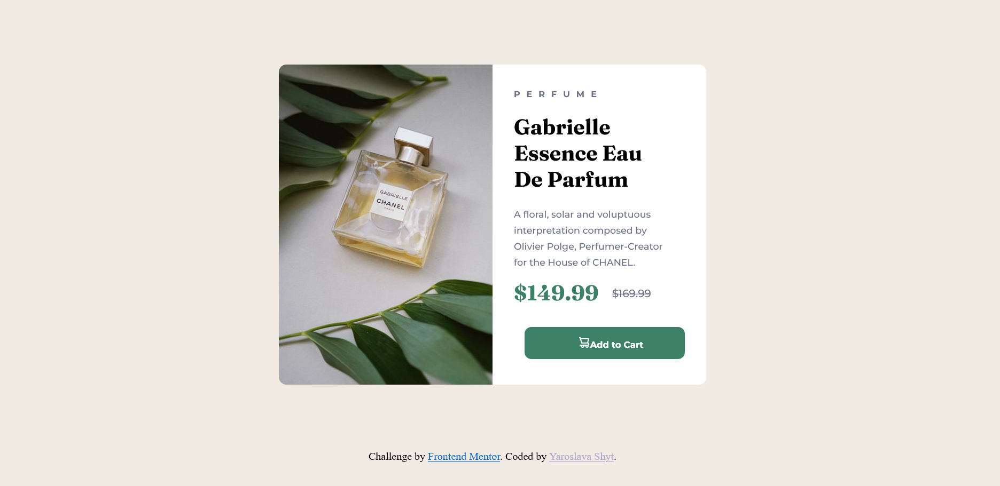

# Frontend Mentor - Product preview card component

This is a solution to the [Product preview card component challenge on Frontend Mentor](https://www.frontendmentor.io/challenges/product-preview-card-component-GO7UmttRfa). 
Frontend Mentor challenges help you improve your coding skills by building realistic projects. 

## Table of contents

- [Overview](#overview)
- [Screenshot](#screenshot)
- [Links](#links)
- [Built with](#built-with)
- [What I learned](#what-i-learned)
- [Author](#author)


## Overview

The task was to build a product preview card component

### Screenshot




### Links

- Solution URL: [mysolution](https://github.com/YaroslavaShyt/product-preview-card-component-main)
- Live Site URL: [result](https://yaroslavashyt.github.io/product-preview-card-component-main/#)

### Built with

- HTML5
- CSS 
### What I learned

- media queries
```css
@media (max-width: 670px){
    main{
        margin: 6.125rem auto;
        background-color: hsl(0, 0%, 100%);
        width: 21rem;
        height: auto;
    }
    #computer-img{
        display: none;
    }
    #mobile-img{
        display: block;
        position: relative;
        float: none;
        padding-right: 0;
        width: 21rem;
        border-top-left-radius: 10px;
        border-top-right-radius: 10px;
        border-bottom-left-radius: 0;
        border-bottom-right-radius: 0;
    }
    .info{
        padding-left: 1.5rem;
    }
    .info h1{
        margin-right: 0rem;
    }
    .info p{
        margin-right: 1rem;
    }
    button{
        padding-bottom: 0.5rem;
        margin-top: 1rem;
        margin-bottom: 1.5rem;
    }
    button img{
        display: inline-block;
        width: 0.9rem;
        height: 0.9rem;
        margin: 0.5rem 0.5rem 0 2rem;
    }
}
```
## Author

- Website - [CV](https://yaroslavashyt.github.io/CV/)
- Frontend Mentor - [@YaroslavaShyt](https://www.frontendmentor.io/profile/YaroslavaShyt)

